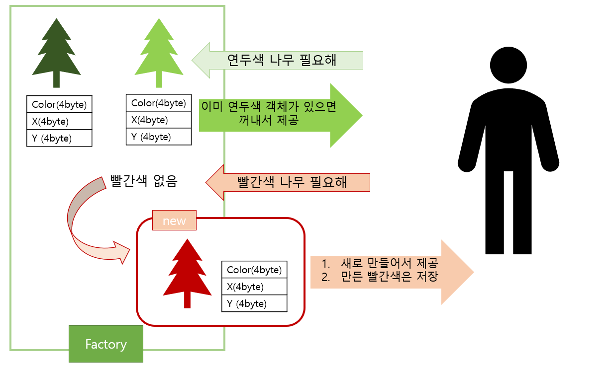

# 생성자 대신 정적 팩토리 메서드를 고려하라

## 정적 팩토리 메서드

- static factory method
- 클래스 인스턴스 반환
- public 생성자 대신 사용

## 왜 사용해야 하는가 (장점)

### 1. 이름을 가질 수 있다

- 반환될 객체의 **특성**을 쉽게 묘사할 수 있다

```java
BigInteger.probablePrime  // 값이 소수인 BigInteger를 반환하는 정적 팩토리 메서드
```

### 2. 호출될 때마다 인스턴스를 새로 생성하지는 않아도 된다

- 불변 클래스 : 미리 만들어놓은 인스턴스 or 캐싱된 인스턴스 재활용
- 생성 비용이 큰 객체 → 성능 향상 가능
    - **플라이웨이트 패턴** :  인스턴스를 가능한대로 공유해서 사용 → 객체 생성을 통한 메모리 낭비↓



- **인스턴스 통제** : 반복되는 요청에 같은 객체 반환
    - 싱글턴으로 만들 수 있음
    - 인스턴스화 불가로 만들 수 있음
- **열거 타입** : 인스턴스 하나만 만들어지는 것을 보장

```java
public enum Menu {
    MUSHROOM_SOUP("양송이수프", 6_000),
    TAPAS("타파스", 5_500),
    CAESAR_SALAD("시저샐러드", 8_000),
    T_BONE_STEAK("티본스테이크", 55_000),
    BBQ_RIBS("바비큐립", 54_000),
    SEAFOOD_PASTA("해산물파스타", 35_000),
    CHRISTMAS_PASTA("크리스마스파스타", 25_000),
    CHOCOLATE_CAKE("초코케이크", 15_000),
    ICE_CREAM("아이스크림", 5_000),
    ZERO_COKE("제로콜라", 3_000),
    RED_WINE("레드와인", 60_000),
    CHAMPAGNE("샴페인", 25_000),
    INVALID("", 0),
    ;

    private final String name;
    private final int price;

    Menu(final String name, final int price) {
        this.name = name;
        this.price = price;
    }

		public static Menu from(final String name) {
				return Arrays.stream(Menu.values())
                .filter(menu -> menu.name.equals(name))
                .findAny()
                .orElse(INVALID);
		}
}
```

### 3. 반환 타입의 하위 타입 객체를 반환할 수 있는 능력이 있다

- `유연성` : 반환할 객체의 클래스 자유롭게 선택
    - API 작게 유지 가능 → 구현 클래스 공개하지 않고도 객체 반환 (ex. 컬렉션 프레임워크)
- **인터페이스** 기반 프레임워크 : 인터페이스를 정적 팩터리 메서드의 반환 타입으로 사용

```java
public interface Badge {
    int STAR_THRESHOLD = 5_000;
    int TREE_THRESHOLD = 10_000;
    int SANTA_THRESHOLD = 20_000;

    static Badge from(final int benefitAmount) {
        if (benefitAmount >= SANTA_THRESHOLD) {
            return new SantaBadge();
        }
        if (benefitAmount >= TREE_THRESHOLD) {
            return new TreeBadge();
        }
        if (benefitAmount >= STAR_THRESHOLD) {
            return new StarBadge();
        }
        return new DefaultBadge();
    }

    String getName();
}
```

### 4. 입력 매개변수에 따라 매번 다른 클래스의 객체를 반환할 수 있다

- 반환 타입의 **하위 타입**이기만 하면 됨
- **EnumSet** 클래스 : 정적 팩터리만 제공
    - 원소 수 → 하위 클래스 RegularEnumSet, JumboEnumSet 중 하나의 인스턴스 반환

### 5. 정적 팩터리 메서드를 작성하는 시점에는 반환할 객체의 클래스가 존재하지 않아도 된다

- **서비스 제공자 프레임워크** (service provider framework)
    - 서비스 인터페이스 : 구현체 동작 정의
    - 제공자 등록 API : 제공자가 구현체 등록
    - **서비스 접근 API** : 클라이언트가 서비스의 인스턴스 획득 → 유연한 정적 팩터리
        - 풍부한 서비스 인터페이스 : 브리지 패턴, 의존 객체 주입 프레임워크, java.util.ServiceLoader
    - 서비스 제공자 인터페이스 : 서비스 인터페이스의 인스턴스를 생성하는 팩터리 객체
- ex) JDBC
    - 서비스 인터페이스 : Connection
    - 제공자 등록 API : DriverManager.registerDriver
    - 서비스 접근 API : DriverManager.getConnection
    - 서비스 제공자 인터페이스 : Driver

## 그렇지만 (단점)

### 1. 상속을 하려면 public이나 protected 생성자가 필요하니 정적 팩토리 메서드만 제공하면 하위 클래스를 만들 수 없다

- 컬렉션 프레임워크의 유틸리티 구현 클래스 → 상속x
    - 컴포지션 사용 유도
    - 불변 타입 사용 유도

### 2. 정적 팩터리 메서드는 프로그래머가 찾기 어렵다

- API 설명에 명확히 드러나지x
- **정적 팩터리 명명 방식**
    - `from` : 매개변수 1개 → 인스턴스 반환 (형변환)
    - `of` : 여러 매개변수 → 인스턴스 반환 (집계)
    - `valueOf` : from과 of의 자세한 버전
    - `instance` / `getInstance` : 매개변수로 명시한 인스턴스 반환
    - `create` / `newInstance` : 매번 새로운 인스턴스 생성 및 반환
    - `getType` : getInstance와 유사 (다른 클래스에 팩터리 메서드 정의)
    - `newType` : newInstance와 유사 (다른 클래스에 팩터리 메서드 정의)
    - `type` : getType과 newType의 간결한 버전

```java
public static Date from(final int day) {
        try {
            return new Date(LocalDate.of(YEAR, MONTH, day));
        } catch (DateTimeException e) {
            throw new IllegalArgumentException(ExceptionMessage.INVALID_DATE.getMessage());
        }
    }
```