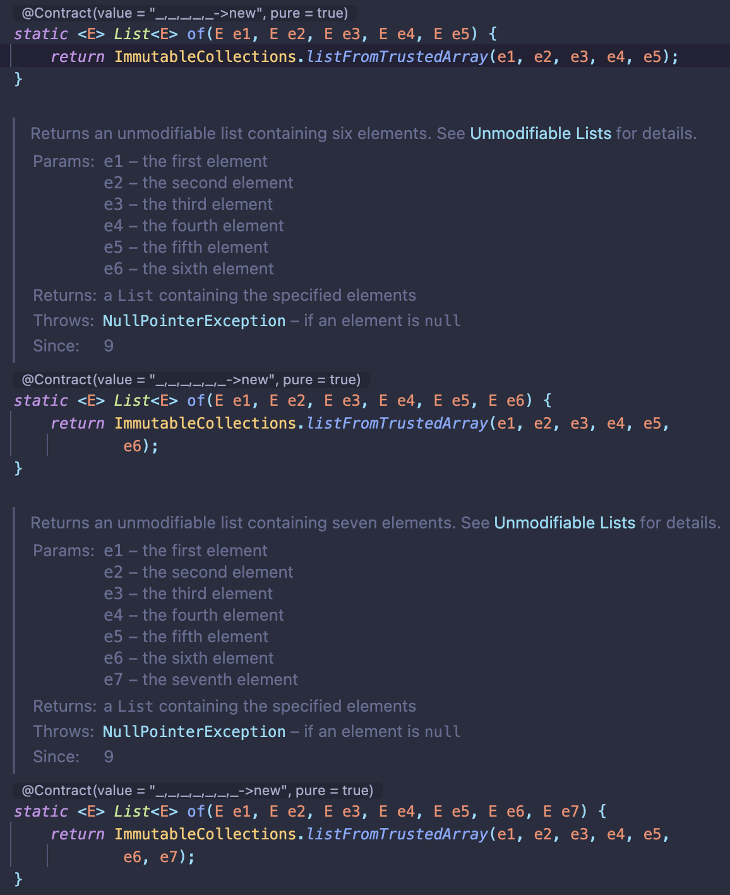

# 생성자에 매개변수가 많다면 빌더를 고려하라

## 정적 팩터리, 생성자의 제약

- 선택적 매개변수가 많을 때 적절한 대응 어려움

## **점층적 생성자 패턴**

- telescoping constructor pattern
    - only 필수 매개변수
    - 필수 매개변수 + 선택 매개변수 1개
    - …
- **BUT** 매개변수 개수↑ → 클라이언트 코드 가독성↓
- **BUT** 매개변수 순서 바뀌는 경우 → 디버깅 어려움 (런타임에 엉뚱한 동작)



## 자바빈즈 패턴

- JavaBeans pattern
- 매개변수 없는 생성자 → setter로 매개변수 값 설정
    - 인스턴스 생성 시, 매개변수 기본값으로 초기화
- **BUT** 객체 생성 시 호출해야 하는 메서드 ↑
- **BUT** 객체 완전해지기 전까지는 일관성(consistency) 무너진 상태
    - 디버깅 어려워짐
    - 클래스를 불변으로 만들 수 없음
    - 스레드 안정성을 위한 추가 작업 필요

## 빌더 패턴

- Builder pattern
- 명명된 선택적 매개변수(named optional parameters)
- 입력 매개변수 유효성 검사 → 빌더의 생성자와 메서드에서 검사
    - build 호출 생성자 → 여러 매개변수에 걸친 불변식 검사
- **계층적으로 설계된 클래스**와 활용 good
    - 추상 클래스 → 추상 빌더
    - 구체 클래스 → 구체 빌더
- simulated self-type 관용구 : 추상 메서드 self()
- 공변 반환 타이핑 (covariant return typing) : 하위 클래스 메서드 → 하위 타입 반환
- 가변인수(varargs) 매개변수 여러 개 사용 가능

```java
public abstract class Pizza {
		public enum Topping { HAM, MUSHROOM, ONION, PEPPER, SAUSAGE }
		final Set<Topping> toppings;

		abstract static class Builder<T extends Builder<T>> {
				EnumSet<Topping> toppings = EnumSet.noneOf(Topping.class);
				public T addTopping(Topping topping) {
						toppings.add(Objects.requireNonNull(topping));
						return self();
				}

				abstract Pizze build();

				protected abstract T self();
		}

		Pizza(Builder<?> builder) {
				toppings = builder.toppings.clone();
		}
}
```

---

1. 필수 매개변수만으로 생성자(정적 팩터리) 호출 → **빌더 객체**
2. 빌더 객체에서 매개변수 설정
3. build() 호출 → 불변 객체 획득

```java
public class DiscountsGenerator {
    private static final int DISCOUNT_THRESHOLD = 10_000;

    private DiscountsGenerator() {
    }

    public static Discounts generate(final Visit visit) {
        List<Discount> discounts = new ArrayList<>();
        if (visit.getOrder().getTotalOrderAmount() < DISCOUNT_THRESHOLD) {
            return Discounts.of(discounts);
        }
        discounts.add(Discount.generateChristmasDiscount(visit.getDate()));
        discounts.add(Discount.generateWeekdayDiscount(visit.getDate(), visit.getOrder()));
        discounts.add(Discount.generateWeekendDiscount(visit.getDate(), visit.getOrder()));
        discounts.add(Discount.generateSpecialDiscount(visit.getDate()));
        return Discounts.of(discounts);
    }
}
```

```java
public class NutritionFacts {
		private final int servingSize;
		private final int servings;
		private final int calories;
		private final int fat;
		private final int sodium;
		private final int carbohydrate;

		public static class Builder {
				// 필수 매개변수
				private final int servingSize;
				private final int servings;

				// 선택 매개변수 - 기본값으로 초기화
				private int calories			= 0;
				private int fat						= 0;
				private int sodium				= 0;
				private int carbohydrate	= 0;

				public Builder(int servingSize, int servings) {
						this.servingSize = servingSize;
						this.servings = servings;
				}

				public Builder calories(int val)
						{ calories = val; return this; }
				public Builder fat(int val)
						{ fat = val; return this; }
				public Builder sodium(int val)
						{ sodium = val; return this; }
				public Builder carbohydrate(int val)
						{ carbohydrate = val; return this; }

				public NutritionFacts build() {
						return new NutritionFacts(this);
				}
		}

		private NutritionFacts(Builder builder) {
				servingSize		= builder.servingSize;
				servings			= builder.servings;
				calories			= builder.calories;
				fat						= builder.fat;
				sodium				= builer.sodium;
				carbohydrate	= builer.carbohydrate;
		}
}
```

### 메서드 연쇄

- method chaining
- 플루언트 API (fluent API)
- 빌더의 setter → 빌더 자신 반환 → 연쇄적 호출 가능

```java
NutritionFacts cocaCola = new NutritionFacts.Builder(240, 8)
		.calories(100).sodium(35).carbohydrate(27).build();
```

### 빌더 패턴의 장점

- 유연하다
    - 여러 객체 순회하면서 생성 가능
    - 매개변수에 따라 다른 객체 생성 가능
    - 매개변수가 많아지는 경우 용이 (API는 시간이 지날수록 매개변수가 많아짐)

### 빌더 패턴의 단점

- 객체 생성 이전에 빌더부터 만들어야함
- 성능에 민감한 상황에서 문제 발생 가능