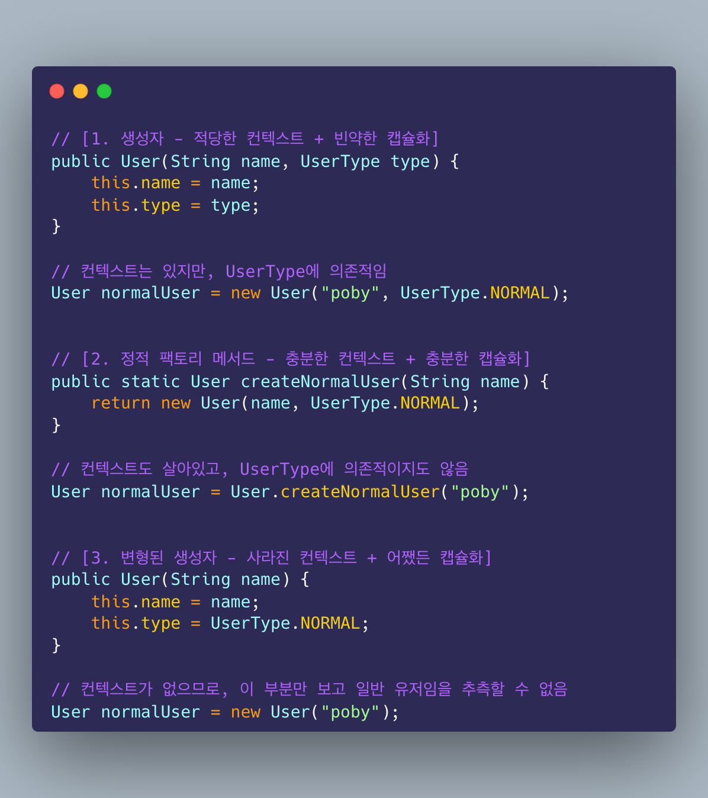

# Item 1. 생성자 대신 정적 팩토리 메서드를 고려하라

객체를 생성할 때는 public 생성자 외에 정적 팩토리 메서드를 사용할 수 있다. 정적 팩토리 메서드란 정적 메서드이면서, 내부적으로 생성자를 호출하여 객체를 생성한 후 반환하는 메서드를 말한다. 원시값을 포장하는 박싱 클래스에서 사용되는 valueOf 메서드가 대표적인 예이다.

정적 팩토리 메서드를 사용할 때의 장점을 알아보자.

### 이름을 가질 수 있다.

이름을 가질 수 있다는 것은 생성 로직에 대한 컨텍스트를 호출자에게 캡슐화하여 전달할 수 있다는 뜻이다. 예전에 클린 코드 발표에서 들었던 예시를 함께 보자.



호출자에게 컨텍스트를 전달하는 방식은 다양하다. 굳이 메서드 이름으로만 전달할 수 있다는 생각을 버려야 한다. 가령 위 예시의 `UserType` 은 이 유저의 타입은 이거구나~ 하는 컨텍스트를 직접적으로 전달한다. 가령 호출자가 인자로 `UserType.NORMAL` 을 넘겨준다면, 일반 유저를 생성한다는 컨텍스트를 바로 확인할 수 있다. 하지만 `UserType` 에 의존하지 않으면서 컨텍스트를 넘겨주고 싶다면? 이때 정적 팩토리 메서드를 사용할 수 있다.

또, 컨텍스트 말고 "캡슐화"의 관점에서 정적 팩토리 메서드를 보자. 아래는 예전에 작성했던 아티클에서 발췌한 (빌더 패턴을 사용한) 수도 코드다.

```java

라면클래스 라면 = 라면클래스
        .조리시작(신라면)
        .물넣기(1000)
        .스프넣기(스프.매운맛)
        .면넣기(면.기본면)
        .끓이기(10분)
        .조리완료();

```

상당히 복잡하지 않은가? 이제 정적 팩토리 메서드 예시를 보자.

```java

라면클래스 라면 = 잘끓인신라면조리();

```

우리는 1번 방식을 "조리시작후물넣고스프넣고면넣고끓인신라면조리하기" 이라고 부르는 대신 "잘끓인신라면조리" 라는 깔쌈한 이름을 붙일 수 있다. 정적 팩토리 메서드의 가장 직관적인 장점이라고 생각한다.


### 호출될 때마다 인스턴스를 새로 생성하지 않아도 된다.

생성자는 바로 객체를 생성한다. 하지만 정적 팩토리 메서드는 그냥 메서드다. 우리가 생성자를 호출하여 객체를 생성하고 그것을 리턴하기 전까지 어떤 짓이든 할 수 있다. 심지어 생성자를 호출하지 않을 수도 있다. 가령 이미 존재하는 객체를 리턴하는 것도 가능하다. 이를 통해 불필요한 객체 생성을 피할 수 있다.

싱글턴이 대표적이다. 싱글턴의 구현에서 생성자는 private 이고, 해당 클래스는 객체를 딱 한번만 생성하고 그 후로는 멤버 변수로 가지고 있는 객체를 리턴하는 방식이다. 이때 이 객체를 리턴하는 메서드가 바로 정적 팩토리 메서드다.


### 반환 타입의 하위 타입 객체를 반환할 수 있는 능력이 있다.

User 클래스를 상속하는 NormalUser, SilverUser, GoldUser 클래스가 있다고 하자. 이때 파라미터로 보유 포인트를 통해 각각의 서브타입을 리턴하는 정적 팩토리 메서드를 작성할 수 있다.

```java
public static User of(int point) {
    if (point < 1000) {
        return new NormalUser();
    } else if (point < 5000) {
        return new SilverUser();
    } else {
        return new GoldUser();
    }
}
```

옛날에는 인터페이스에 정적 메서드를 사용하지 못했기 때문에, `Collection` 인터페이스를 반환하는 메서드가 필요하면 관례적으로 s가 붙은 인스턴스화 되지 않는 정적 유틸리티 클래스인 `Collections` 를 사용했다. 이 유틸리티 구현체는 45개나 존재했는데, 이를 하나의 인터페이스로 얻게하면서 프레임워크를 간소화시킬 수 있었다. 물론 지금은 인터페이스에 정적 메서드를 사용할 수 있기 때문에 굳이 동반 클래스를 만들 필요가 없다.


### 입력 매개변수에 따라 매번 다른 클래스의 객체를 반환할 수 있다.

위와 동일한 이야기이지만, 새로운 예시를 보자.

```java 
public static User of(UserType userType) {
    if (userType == UserType.NORMAL) {
        return new NormalUser();
    } else if (userType == UserType.SILVER) {
        return new SilverUser();
    } else {
        return new GoldUser();
    }
}
```

객체를 생성하는 조건이 외부로 빠져나왔다는 점을 체크하자. 그렇다는 말은 다양한 맥락에서의 생성 조건을 지정할 수 있다는 것이다. 가령 point는 `User`의 멤버 변수가 아니지만 유저의 생성 조건을 지정하고 있다. 반면 아래 예제에서는 User의 멤버 변수인 UserType을 통해 생성 조건을 지정하고 있다.


### 정적 팩토리 메서드를 작성하는 시점에는 반환할 객체의 클래스가 존재하지 않아도 된다.

어려운 말이 많긴 한데 JDBC를 예시로 생각하면 편하다. JDBC API에는 여러 인터페이스들이 정의되어 있다. 다양한 데이터베이스 벤더사들은 이 인터페이스에 대한 자사의 구현체를 제공한다. 이때, 서비스 접근 API라는 친구는 다양한 구현체를 돌면서 해당 구현체가 존재하는지 확인하고, 존재한다면 해당 구현체를 리턴한다. 이때 서비스 접근 API는 인터페이스를 리턴한다. 이 인터페이스를 리턴하는 메서드가 바로 정적 팩토리 메서드다. 하지만 이 정적 팩토리 메서드가 작성되었을 때는 벤더사들이 아직 구현체를 제공하지 않았을 것이다. 그런 뜻...


## 단점?

### 상속을 하려면 public이나 protected 생성자가 필요하니 정적 팩토리 메서드만 제공하면 하위 클래스를 만들 수 없다.

정적 유틸리티 클래스라면 인스턴스화가 불가능하므로, 생성자 없이 정적 팩토리 메서드만 제공할 수도 있다. 이때 private 생성자를 사용하므로 상속이 불가능하다. 하지만 상속은 그냥 어지간하면 피하는 편이 좋기 때문에 큰 단점이라고 보기는 어렵다.

혹은 일반 도메인 클래스에서도 정적 팩토리 메서드를 통한 생성만을 허용하기 위해 내부적으로만 객체를 생성할 수 있게 하고, 생성자의 경우 private로 선언하는 경우도 있다.

### 정적 팩토리 메서드는 프로그래머가 찾기 어렵다.

이 것도 큰 단점은 아니다.
new와 다르게 번거롭다고 생각할 수 있다. 그리고 객체의 생성 방식이 너무 많아지는 것도 좋지 않다.
(필요하지 않다면) 객체의 생성 방식을 통일해야 하고, 이때 정적 팩토리 메서드를 사용하면 해결할 수 있다. API 문서화를 잘 해야 한다고 하는데 요즘 IDE가 워낙 잘 해주기 때문에 진짜 단점은 아닌 것 같다.