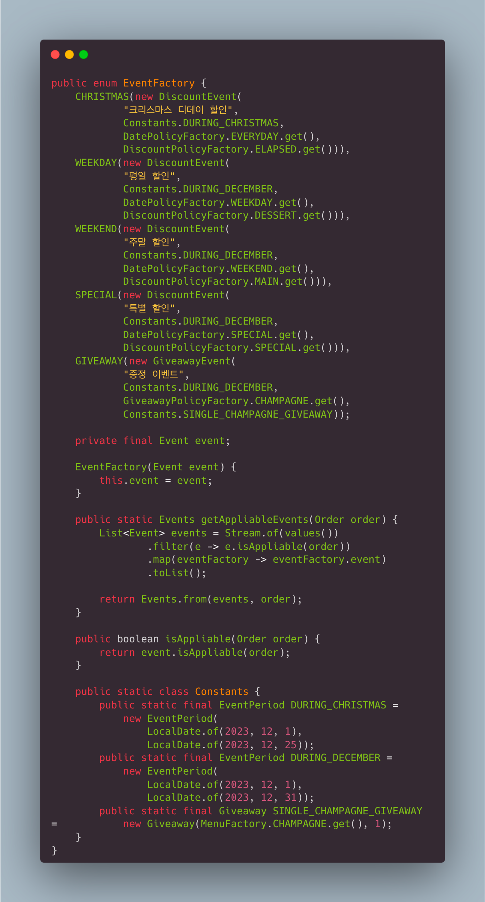

# Item 3. private 생성자나 열거 타입으로 싱글턴임을 보증하라

싱글턴이란 인스턴스가 오직 하나만 생성됨이 보장되는 클래스를 말한다. 싱글턴은 주로 유틸리티 메서드들을 제공하는 클래스에 대해서 적용될 수 있다. 이러한 클래스들은 상태를 가지지 않는다. 상태를 가지지 않는다는 것은 내부에 멤버 변수가 선언되지 않은 것을 의미한다.

상태를 가지는 클래스의 경우 인스턴스는 여러 상태를 가질 수 있어야 하므로 오히려 싱글턴이면 안된다. 하지만 상태가 없이 오직 메서드만 사용되는 경우 여러 개 생성할 이유가 없이 때문에 싱글턴으로 사용한다.

싱글턴은 테스트하기 어렵다. 책에서는 인터페이스와 구현을 분리하고, 목 구현을 만들어서 테스트하면 되지 않냐... 라고 하는데, 이는 싱글턴에 대한 의존성을 가지는 객체를 테스트하기 위함이지, 싱글턴의 구현 자체를 테스트하는 것이 아니다.

싱글턴을 구현하는 다양한 방식들이 있다. 먼저 내부에 `public static final User INSTANCE = new User()` 와 같이 불변하는 공개 정적 멤버를 통해 구현할 수 있다. 그리고 `private User() {}` 와 같이 생성자를 비공개로 변경한다. 단 리플렉션을 사용하면 호출할 수 있기 때문에, 생성자에서 호출 횟수를 관리하여 예외를 던지게 해야 한다.

아니면 정적 팩토리 메서드를 통해 구현할 수 있다. 흔히 `getInstance()` 라는 이름을 쓴다. 방식은 간단하다. 역시 생성자를 숨기고, 내부 비공개 정적 멤버의 참조를 리턴하는 방식이다.

마지막으로 열거형을 통해 구현할 수 있다. 열거형은 "자바에서 가장 간결한 방식으로, 확실하게 싱글턴을 만들 수 있는 방법"이다. 단 열거형을 사용하지 않는다면 쓸 수가 없다. 

혹은, 열거형의 멤버에 우리가 싱글턴이기를 원하는 인스턴스를 할당하여, 유사 싱글턴처럼 쓸 수 있다. 

각 Event 객체들은 new Event를 통해 생성할 수 있으므로 싱글턴이 아니다. 하지만 코드 작성 시 Event에 대한 생성자 사용을 정적 코드 분석으로 검출하도록 하고, 그 외에는 항상 EventFactory를 통해 참조를 얻도록 하면 싱글턴처럼 사용할 수 있다.
