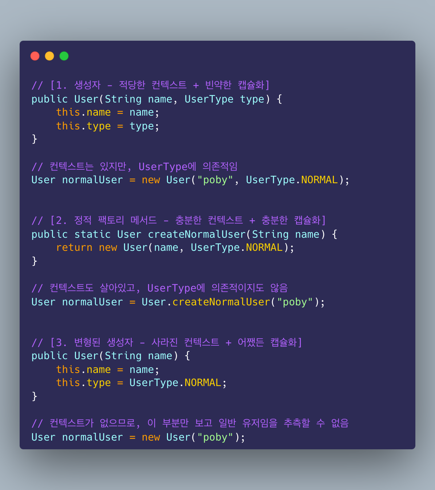

# Item 6. 불필요한 객체 생성을 피하라

## 문자열에 대한 이야기

객체를 매번 생성하는 것은 비싸다. 필요에 따라 객체를 재사용할 수 있어야 한다. 이때 불변 객체를 활용하면 여러 상황 (특히 멀티 스레드 환경) 에서 안전하게 재사용할 수 있다. 한편, 문자열의 경우 `new` 생성자를 사용하는 방식을 지양해야 한다. 대신 문자열 리터럴을 사용해야 한다 (e.g. `String s = "string"`). 이는 문자열 리터럴이 힙의 "String Constant Pool" 에 저장되는 반면, `new` 생성자를 사용하면 일반적인 힙 영역에 저장되기 때문이다. 이러면 같은 내용을 가진 문자열이라도 다른 객체로 인식되어, 불필요한 객체 생성이 발생한다.

문자열 리터럴을 사용하면 같은 내용의 문자열을 아무리 많이 사용하더라도 단일한 문자열 상수 풀(SCP)의 내용을 참조하게 된다. 따라서 굳이 equals가 아니라 ==을 사용하더라도 같은 SCP에 위치로 접근하게 되므로 true를 리턴한다. 이러한 구현에는 리터럴을 통한 선언 시 내부적으로 `intern()` 메서드를 호출하는 원리가 담겨있다. `intern()` 메서드는 SCP에 문자열이 존재하는지의 여부에 따라 문자열을 풀에 추가한 후 참조값을 반환하거나 이미 존재하는 경우 그 참조값을 바로 리턴한다.

또한 SCP는 Hash Table 방식으로 구현되어 있어 O(1)로 빠르게 접근할 수 있다.

SCP의 구현은 자바 버전이 업그레이드됨에 따라 계속해서 진화해왔다. Java 7 이전에는 SCP를 PermGen(혹은 Perm 영역)이라는 공간에 저장했다. 하지만 Java 8부터 이 Perm 영역은 삭제되었고 대신 Metaspace라는 영역으로 대체되었다.

Permgen에는 SCP 외에도 1) 클래스 / 메서드 메타데이터 2) JVM, JIT 관련 데이터 등을 저장했다. 하지만 Perm 영역에는 이런저런 문제가 존재했다. 먼저, 이 영역은 JVM에 의해 관리되므로, JVM 시작 시 `-XX:PermSize=128m -XX:MaxPermSize=128m` 나 `-Xms`, `-Xmx` 플래그로 사이즈가 고정되어 있었다. 그런데 여기에 들어가는 메타데이터의 크기를 쉽게 예측할 수 없었기 때문에, 클래스 로딩이 많이 일어나는 경우 OOM(Out Of Memory)가 발생할 수 있었다. 뿐만 아니라 Perm 영역은 힙 영역의 일부인 주제에 GC의 대상이 아니었기 때문에, OOM의 발생 가능성이 더욱 높아졌다.

이러한 문제 때문에 Java 7 아래에서는 `String.intern()` 도 신중하게 사용해야 했다. 왜냐면 무작정 intern() 을 통해서 여러 번 사용되지도 않은 문자열을 SCP에 집어넣게 되면 1) 안그래도 픽스된 사이즈를 가져서 부족할 수도 있는 Perm 영역에 저장되는데 2) 이렇게 저장된 문자열은 GC의 대상이 아니므로 OOM에 매우매우 취약했기 떄문이다.

앞서 말했듯 Java 8부터는 Perm 영역이 삭제되고 Metaspace로 대체되면서 이러한 문제점들에 대해 많은 개선이 이루어졌다. Metaspace는 위 사진에서 볼 수 있듯이 힙 영역이 아닌 네이티브 메모리 영역에 속해있다. 같은 메모리 영역이지만 힙 메모리는 JVM에 의해서 관리되고 네이티브 메모리는 OS에 의해서 관리된다. 이때 메타스페이스 영역의 크기는 디폴트로 최대값으로 설정되어 있기 때문에 더 이상 Perm의 사이즈에 대해서 고민할 필요는 없다 (오히려 네이티브 메모리를 너무 많이 써서 제한해줄 필요는 있어도, 너무 작아서 전전긍긍할 필요는 없다). 

OS는 이 메타스페이스 영역의 크기를 런타임에도 자동으로 조절할 뿐만이 아니라, 메타스페이스 내부에 저장된 메타데이터에 대해서도 GC가 작동하기 때문에 더 효율적인 메모리 사용이 가능하다. 단, 메타데이터의 GC는 다른 GC와 다르게 메타스페이스 영역의 메모리가 꽉 차기 전에는 작동하지 않는다. 

### 레퍼런스
- https://blog.ggaman.com/918
    - java 8 이전의 SCP 및 `intern()` 사용 시 OOM에 대해서 주의해야 한다는 고대의 글이다.
- https://www.baeldung.com/java-string-pool
- https://johngrib.github.io/wiki/java8-why-permgen-removed/
    - Perm 및 Metaspace 관련 JEP 122에 대한 글이다.
- https://obv-cloud.com/4
    - Metaspace 및 GC에 대해서 자세히 서술되어 있는 글이다.