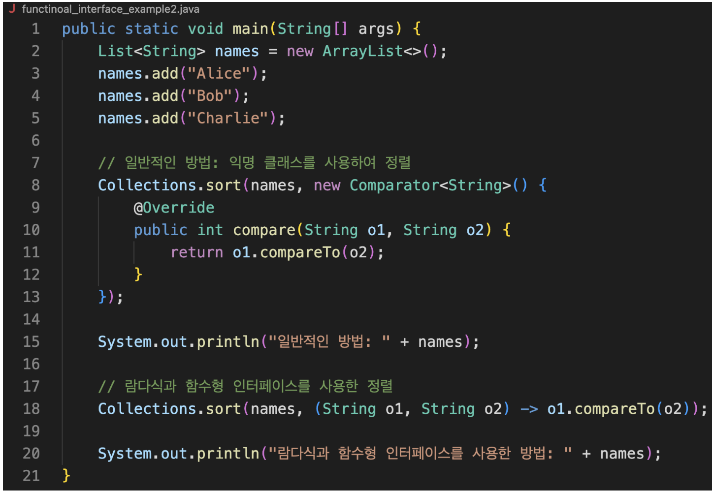

# Item 24. 멤버 클래스는 되도록 static으로 만들라

정적 멤버 클래스는 외부 클래스와 함께 쓰이는 헬퍼 클래스로 사용된다. 바깥 클래스의 private 멤버에 접근할 수 있다. 비정적 멤버 클래스는 static 키워드가 없어진 것이고 '이 클래스(외부)의 인스턴스'에 속한다는 의미를 가지게 된다. 이때 this와 정규화된 this를 구별해서 사용해야 한다. 비정적 멤버(내부 클래스)에서 this를 사용하는 경우 자기 자신(내부)를 의미하지만, 외부 클래스의 this를 사용하고 싶다면 정규화된 this를 사용해야 한다. 

```java
public class Outer {

    private final String name;

    public Outer(String name) {
        this.name = name;
    }

    private class Inner {
        public final String name;

        public Inner(String name) {
            this.name = name;
        }

        public void print() {
            System.out.println("Outer.this.name = " + Outer.this.name);
            System.out.println("this.name = " + this.name);
        }
    }
}
```

이러한 비정적 멤버 클래스는 바깥 클래스의 인스턴스와 암묵적으로 연결된다. 즉 바깥 인스턴스가 초기화될 때 비정적 멤버 클래스의 인스턴스도 함께 생성된다. 따라서 Inner 클래스가 Outer 클래스와 개념적으로 의존적인 관계가 아니라, 독립적으로 존재할 수 있다면 정적 멤버 클래스로 만드는 것이 좋다. 그렇지 않으면 Inner 클래스의 인스턴스에 접근하기 위해서는 Outer 클래스의 인스턴스가 반드시 존재해야 하는 불상사가 생긴다. 

이러한 암묵적인 연결을 명시적으로, 즉 `Outer.new Inner()` 와 같이 표현할 수도 있다. 하지만 비용이나 시간이 많이 들기 때문에 권장하지 않는다.

Inner가 Outer와 개념적으로 독립되어 존재할 수 있다면 static으로 만들어야 한다고 했다. 추가로 Inner에서 Outer의 인스턴스 (Outer.this)에 접근할 일이 없다면 static으로 만드는 것이 좋다. 그렇지 않으면 앞에서 언급했듯 inner는 outer로의 숨은 외부 참조를 갖게 되어 메모리 누수가 발생할 수 있기 때문이다.

익명 클래스는 함수형 인터페이스, 람다식과 많이 얽힌다. 이 셋의 관계를 짧게 요약하자면, "람다식은 함수형 인터페이스를 구현한 익명 클래스의 인스턴스이다." 이다. 

https://yozm.wishket.com/magazine/detail/2023/



위 사진은 '함수형 인터페이스를 구현한 익명 클래스의 인스턴스'를 람다식으로 대체한 것을 나타낸다. 람다식이 추가되고 난 후에는 익명 클래스를 사용할 일이 많이 줄었다. 람다식이 아닌 익명 클래스의 사용처로는 정적 팩토리 메서드 등이 있지만 잘 사용하지 않는다.

지역 클래스는 블록 안에 정의된 클래스이다. 바깥 멤버에 접근 할 수 있다. 지역변수와 스코프가 같기 때문에 같은 이름으로 변수를 선언하면 가려짐이 발생한다. 마찬가지로 비정적 컨텍스트에서 사용되어야 외부 인스턴스를 참조할 수 있다.

